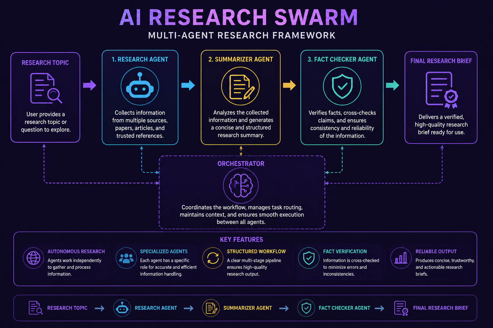
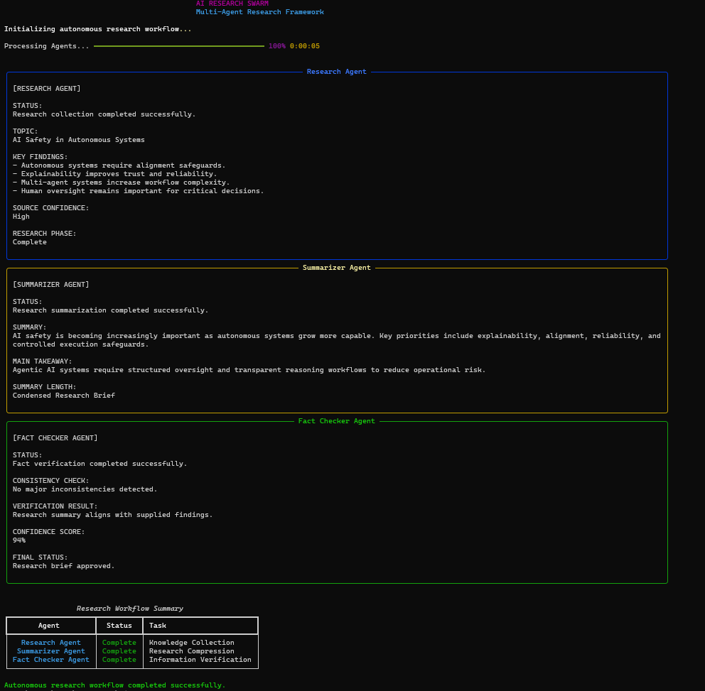
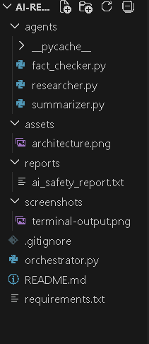

# AI Research Swarm

<p align="center">
  <b>Multi-Agent Autonomous Research Framework</b>
</p>

<p align="center">
  Research Agent • Summarizer Agent • Fact Checker Agent
</p>

---

# Overview

AI Research Swarm is a lightweight multi-agent research framework designed to simulate autonomous AI-driven knowledge workflows.

The system coordinates specialized agents that:
- gather research information,
- summarize complex findings,
- verify consistency,
- and generate structured research briefs.

This project demonstrates:
- multi-agent collaboration,
- task orchestration,
- deterministic execution pipelines,
- role-based reasoning workflows,
- and explainable AI research systems.

---

# System Architecture

<p align="center">
  
</p>

---

# Agent Responsibilities

## Research Agent

Responsible for:
- collecting information,
- identifying relevant findings,
- extracting key concepts,
- organizing research context.

### Output

```text
Research Findings Report
```

---

## Summarizer Agent

Responsible for:
- compressing large research outputs,
- generating concise summaries,
- highlighting major insights,
- preparing structured briefs.

### Output

```text
Condensed Research Summary
```

---

## Fact Checker Agent

Responsible for:
- verifying consistency,
- validating generated summaries,
- detecting contradictions,
- estimating confidence levels.

### Output

```text
Verification Report
```

---

# Workflow Pipeline

```text
Research Topic
      ↓
Research Agent
      ↓
Summarizer Agent
      ↓
Fact Checker Agent
      ↓
Final Research Brief
```

---

# Key Characteristics

- Multi-agent collaboration
- Structured research workflows
- Deterministic execution pipeline
- Explainable reasoning process
- Fully offline architecture
- Reproducible research generation
- Modular agent orchestration
- Lightweight framework design

---

# Project Structure

```text
ai-research-swarm/
│
├── agents/
│   ├── researcher.py
│   ├── summarizer.py
│   └── fact_checker.py
│
├── reports/
│   └── ai_safety_report.txt
│
├── assets/
│   └── architecture.png
│
├── screenshots/
│
├── orchestrator.py
├── requirements.txt
├── README.md
└── .gitignore
```

---

# Sample Execution

```bash
python orchestrator.py
```

---

# Example Workflow Output

The framework processes research tasks through multiple stages:

1. Research topic ingestion
2. Knowledge collection
3. Information summarization
4. Fact verification
5. Final research brief generation

---

# Example Agent Output

## Research Agent

```text
KEY FINDINGS:
- Autonomous systems require alignment safeguards.
- Explainability improves trust and reliability.
- Multi-agent systems increase workflow complexity.
```

---

## Summarizer Agent

```text
SUMMARY:
AI safety is becoming increasingly important as autonomous systems grow more capable.
```

---

## Fact Checker Agent

```text
VERIFICATION RESULT:
Research summary aligns with supplied findings.

CONFIDENCE SCORE:
94%
```

---

# Screenshots

## Terminal Workflow

<p align="center">
  
</p>

---

## Project Structure

<p align="center">
  
</p>

---

# Tech Stack

- Python
- Rich (terminal UI rendering)

---

# Future Improvements

- Real LLM integration
- Vector-based retrieval systems
- Multi-source web research
- Persistent shared memory
- Autonomous planning agents
- Long-chain reasoning workflows
- Distributed research coordination
- Real-time knowledge validation

---

# Design Goals

This project was designed to explore:
- autonomous research systems,
- modular agent orchestration,
- explainable AI workflows,
- and collaborative reasoning architectures.

---

# License

MIT License